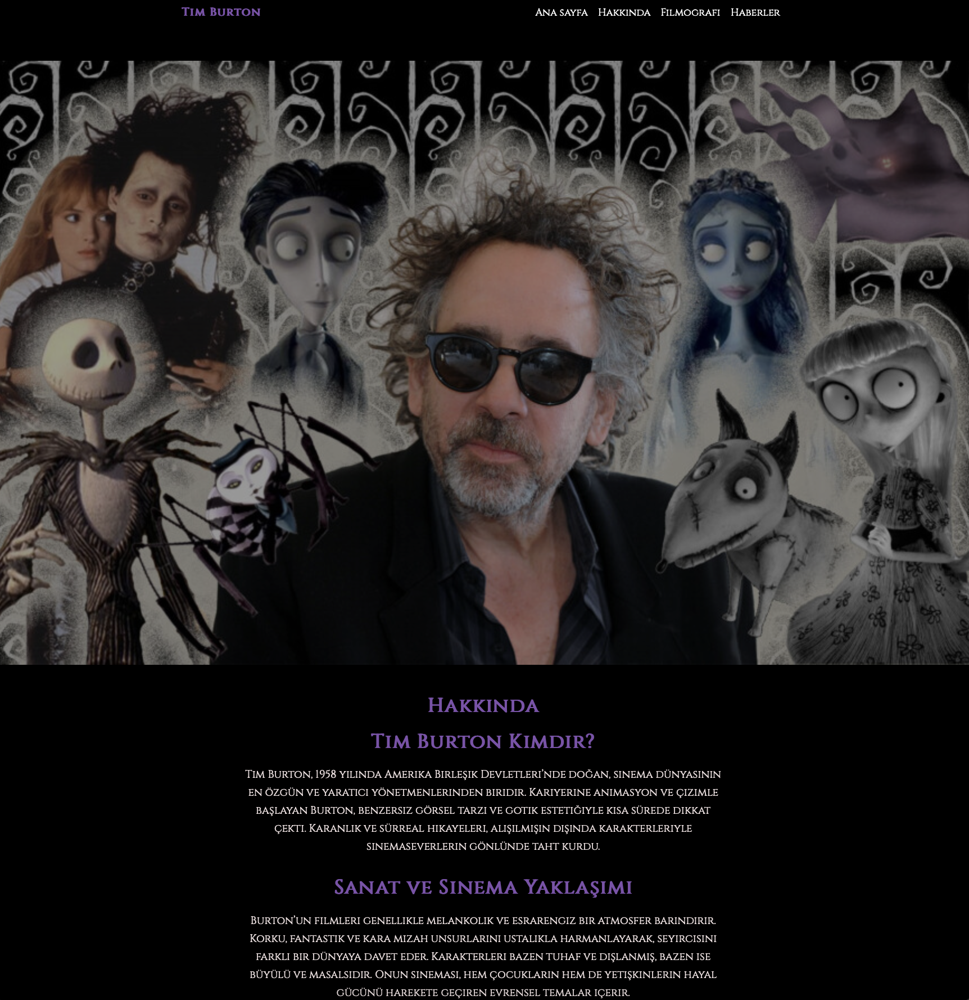
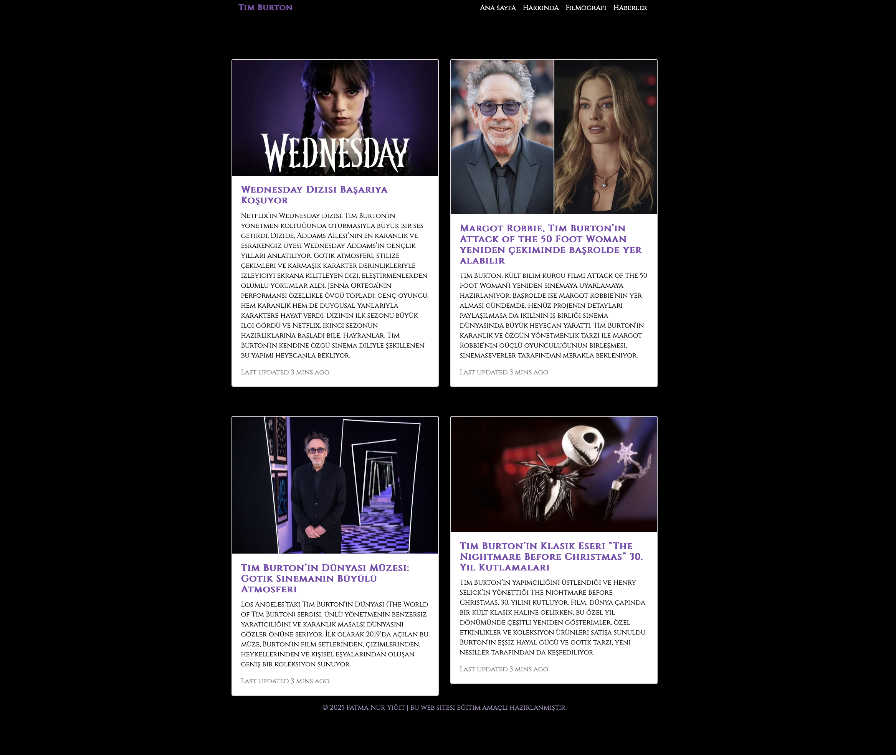

# Bootstrap Web Sitesi - Tim Burton Teması

Bu proje, Bootstrap kullanılarak yapılmış ve Tim Burton temalı bir web sitesi örneğidir. Site dört ana bölümden oluşmaktadır: Anasayfa, Hakkında, Filmografi ve Haberler.

 Proje Hakkında

Bu proje, Bootstrap framework'ü ile responsive, modern ve görsel olarak zengin bir web sitesi oluşturmayı amaçlamaktadır. Tim Burton hayranları için özel olarak tasarlanmıştır.

 Özellikler

- Responsive tasarım
- Bootstrap 4/5 kullanımı
- Kolay özelleştirilebilir yapılar
- Dört ana sayfa: Anasayfa, Hakkında, Filmografi, Haberler

---

 Sayfa Görünümleri

### Anasayfa

### Hakkında

### Filmografi

### Haberler

---

Bu linkten sayfaya ulaşabilirsiniz 
 https://github.com/fnuryigit/Bootstrap_web_sitesi.git
